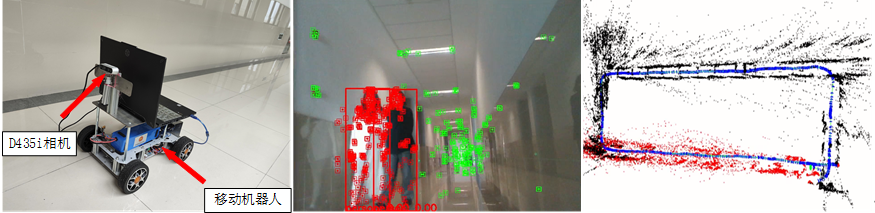

# Objecct-SLAM

# Object-Level Dynamic SLAM Integration of Object Detection and Optical Flow

[video](https://www.bilibili.com/video/BV1NB2tYyEBa/?spm_id_from=333.999.0.0&vd_source=152ca365ebbc6b0b9053aa2d72badc53)

## System 

## Dynamic object track

### Placing_No_Box  

### Compared with OA-SLAM, Removing _No_Box

## Dense map

## Real Scene - Sequence 01

## Real Scene - Sequence 02

### loop closure

